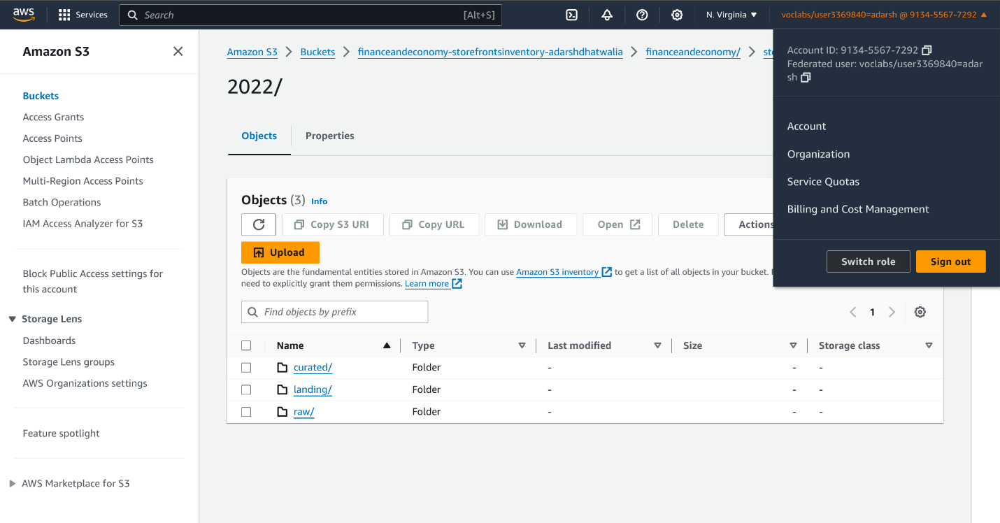
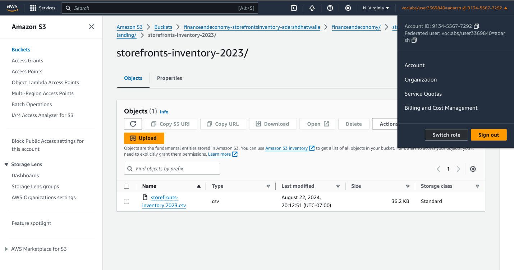
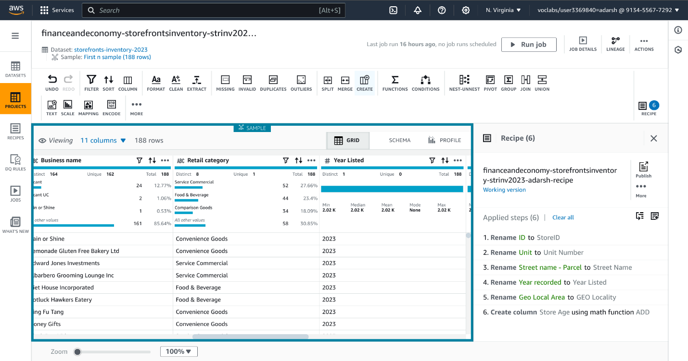
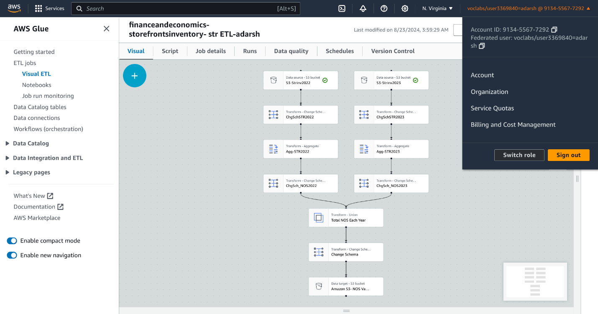
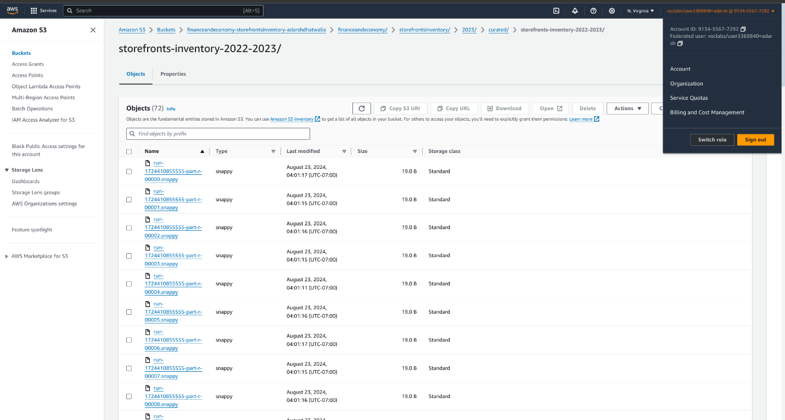
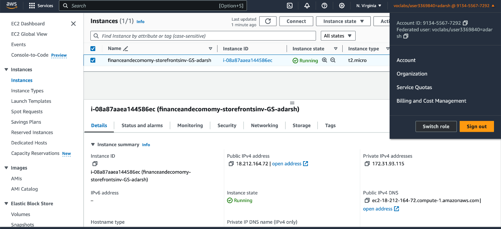
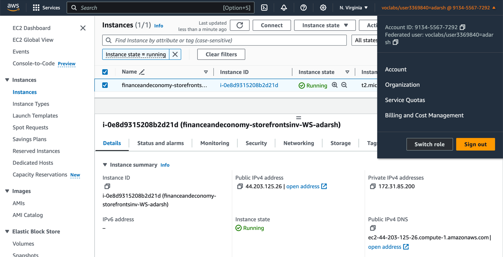

# Descriptive Analysis 

## Project Description: Descriptive Analysis of Storefront Inventory Patterns

### Project Title: Understanding Storefront Inventory Trends in the City of Vancouver

#### Objective
The primary goal of this project is to conduct a descriptive analysis of storefront inventory data for the City of Vancouver. Through this analysis, we aim to summarize key characteristics of storefront availability, identify trends over the years, and generate insights that can inform city planning, business development, and retail strategy in Vancouver.

#### Dataset
The dataset includes storefront inventory data for 2022 and 2023 from the City of Vancouver's Open Data Portal, containing the following key features:

- ID: Unique identifier for each entry.
- Unit: Unit number (if available).
- Civic number - Parcel: The street number of the property.
- Street name - Parcel: The name of the street where the property is located.
- Business name: The name of the business occupying the storefront.
- Retail category: The type of retail or service provided (e.g., Service Commercial, Food & Beverage, Vacant).
- Year recorded: The year the data was recorded (e.g., 2022).
- Geo Local Area: The local neighborhood area (e.g., Kitsilano, Arbutus Ridge).
- Geom: Geospatial data in JSON format representing the coordinates of the property.
- geo_point_2d: The latitude and longitude coordinates of the property.

#### Pipeline

### Methodology

1. **Data Collection and Discovery**
   - Access data from Vancouver's Open Data Portal, specifically for the years 2022 and 2023.
   - Use the "Year recorded" parameter to gather historical storefront data for comparison and analysis.
   - Identify patterns in the dataset by analyzing the yearly changes in the number of storefronts and business categories.

   
2. **Data Storage Design**

   - Use AWS S3 to design a structured storage system:
     - Created a bucket called "Finance and Economy" with subfolders "2022" and "2023" for easy data handling.
     - Each subfolder was divided into "Landing," "Raw," and "Curated" stages to organize the data by processing phase.
       

3. **Dataset Preparation**
   - Reduce the dataset to 188 entries for each year (2022 and 2023) to focus on the most relevant data.
   - Ensure that the dataset is ready for further analysis by filtering out unnecessary records and columns.

4. **Data Ingestion & Storage**
   - Upload CSV files for the years 2022 and 2023 into their respective "Landing" folders in AWS S3.
   - Organize the data files by year and processing stage to maintain clarity and streamline future data processing.

5. **Data Cleaning & Structuring**
   - Use AWS DataBrew to inspect and clean the data for 2022 and 2023:
     - Removed errors, duplicates, and anomalies to improve the dataset's quality.
     - Renamed columns to maintain consistency across both years.
     - Modified data types to ensure accuracy and consistency.
     - Created a "Store Age" column to calculate the age of each store based on the listing year.
    

6. **Data Pipeline Implementation**
   - Build and run an ETL pipeline using AWS Glue:
     - Deleted unnecessary columns and standardized the schema for 2022 and 2023 datasets.
     - Aggregated the total number of storefronts for each year, ensuring consistency in naming conventions.
     - Unified the datasets into a single file for further analysis, stored in the Curated folder on AWS S3.

7. **Data Analysis**
   - Set up a database and table in AWS Athena to analyze the cleaned data:
     - Queried the data to calculate the total number of storefronts for each year.
     - Named the database "financeandeconomy_storefrontsinventory_database_adarsh" and table "financeandeconomy_storefrontsinventory_table1_adarshdhatwalia".

8. **Data Visualization**
   
   - Generate a report using SQL queries and download the data in CSV format.
   - Created a bar graph using data from 2022 and 2023 to visualize trends in the number of stores. (Using Excel)

9. **Data Publishing**
   - Use Amazon EC2 to deploy two servers (General and Web servers):
     - Transferred the CSV and PDF files to the General Server using Remote Desktop.
     - Installed and deployed IIS (Internet Information Services) on the Web Server to publish the data and allow access through the server's IP address.

10. **Storefronts Segmentation**
    - Segment storefronts by year of opening (2022 vs. 2023).
    - Examine the net change in the number of stores year-over-year.

11. **Insights and Findings**
    - Summarize insights derived from the analysis, focusing on:
      - Changes in the total number of storefronts between 2022 and 2023.
      - Trends across business categories, identifying which sectors (e.g., Retail, Food Services) are experiencing growth or decline.

12. **Recommendations**
    - Propose incentives or support for business categories experiencing declines.
    - Suggest urban planning strategies for areas with a high number of vacancies.

### Tools and Technologies
- MS Excel for initial data handling and basic visualizations.
- AWS Glue for building and managing ETL pipelines.
- AWS DataBrew for cleaning, organizing, and structuring datasets.
- Amazon S3 for data storage and management.
- AWS Athena for querying data and performing analysis.
- Amazon EC2 for hosting and deploying servers to publish data.
- Draw.io for visualizing the ETL pipeline.
- Tableau or Power BI for creating advanced visual dashboards (optional)

### Deliverables
- A comprehensive report summarizing the analysis and recommendations.
- Visualizations that clearly display the data insights.
- A presentation to share findings with relevant stakeholders.

This descriptive analysis project aims to provide a comprehensive understanding of storefront inventory trends in the City of Vancouver, enabling city planners and business owners to make informed decisions, optimize urban development strategies, and enhance business sustainability.

# DAP Design and Implementation

## Step 1: Data Analytical Question Formulation

To properly analyze the storefront inventory data, I developed a set of data analytical questions divided into descriptive, diagnostic, predictive, and prescriptive categories. Each question is intended to provide insight into various facets of the City of Vancouver's storefront inventory.

- **Descriptive Metric (Total Number of Stores Each Year)**: Provides insight into retail trends, determining if stores are increasing, decreasing, or remaining stable.
- **Diagnostic Metric (Distribution of Retail Categories)**: Investigates factors influencing the number of storefronts over time, such as economic conditions and regulatory changes.
- **Predictive Metric (Trends in New Business Openings)**: Estimates future patterns in storefront vacancies and openings using historical data.
- **Prescriptive Metric (Geographic Analysis of Business Density)**: Aims to provide actionable strategies for reducing storefront vacancies and encouraging new business openings.

*Figure 1: DAQ Formulation*

## Step 2: Data Discovery

I accessed and downloaded the storefront inventory dataset for 2022 and 2023 from Vancouver's Open Data Portal. The "Year recorded" parameter was used to identify essential patterns in storefront inventory.

*Figure 2: Storefronts-Inventory City of Vancouver*

## Step 3: Data Storage Design

I structured our AWS S3 storage as follows:
- Main bucket: "Finance and Economy"
  - Folder: "Storefronts Inventory"
    - Subfolders: "2022" and "2023"
      - Each subfolder contains: "Landing," "Raw," and "Curated"

*Figure 3: Amazon S3 Design*

## Step 4: Dataset Preparation

The dataset was reduced to 188 entries each for 2022 and 2023 to focus on the most essential data.

*Figure 4: Dataset for 2022 and 2023*

## Step 5 & 6: Data Ingestion & Storage

CSV files for 2022 and 2023 were uploaded to their respective "Landing" folders within the AWS S3 structure.

*Figure 5: Data Ingestion and Storage for 2022 & 2023*

## Step 7: Data Pipeline Design

An ETL pipeline was designed using Draw.io to visualize the process of combining and organizing the 2022 and 2023 datasets.

*Figure 6: Draw.io Diagram*

## Step 8 & 9: Data Cleaning & Structuring

AWS DataBrew was used to clean and structure the datasets:
- Removed errors, duplicates, and anomalies
- Renamed columns for consistency
- Modified data types
- Created a new "Store Age" column

*Figure 7: Data cleaning of 2022 and 2023 datasets*

*Figure 8: Data structuring of 2022 and 2023 datasets*

## Step 10: Data Pipeline Implementation

AWS Glue was used to implement the ETL pipeline:
- Removed unnecessary columns
- Standardized schema
- Aggregated data to determine total number of stores by Year Listed
- Unified datasets into a single dataset

*Figure 9: ETL pipeline in AWS Glue*

## Step 11: Data Analysis

AWS Athena was used to set up a database and table for analyzing the data:
- Database name: "financeandeconomy_storefrontsinventory_database_adarsh"
- Table name: "financeandeconomy_storefrontsinventory_table1_adarshdhatwalia"

*Figure 10: Data Analysis in AWS Athena*

## Step 12: Data Visualization

SQL query results were downloaded in CSV format and used to create a bar graph in Excel.

*Figure 11: Data Visualization in Excel*

## Step 13: Data Publishing

Amazon EC2 was used to launch two server instances (General and Web servers) for data publishing:
- General Server: Used for file transfer via Microsoft Remote Desktop
- Web Server: Deployed IIS (Internet Information Services) for hosting the reports

*Figure 12: Data Publishing in General and Web Server*

## Conclusion

The AWS data analytical platform created for the City of Vancouver successfully met the crucial requirements of data migration and extensive analytics. The project optimized the entire process using AWS Glue, Athena, and other cloud capabilities, resulting in a robust infrastructure for Vancouver's current and future data needs.

This platform enhances the city's data management capabilities and paves the way for more advanced data-driven projects. The insights gained enable city officials to make better decisions about improving public services, managing economic growth, and addressing environmental concerns.

Overall, this project has set a new standard for municipal data management, ensuring that the City of Vancouver is well-prepared to face future challenges with data-driven strategies.
