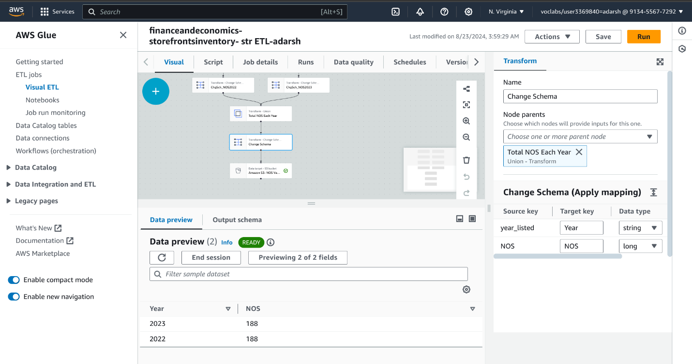
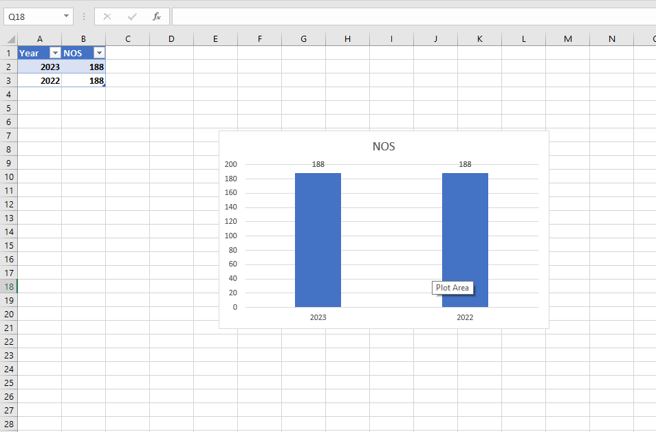
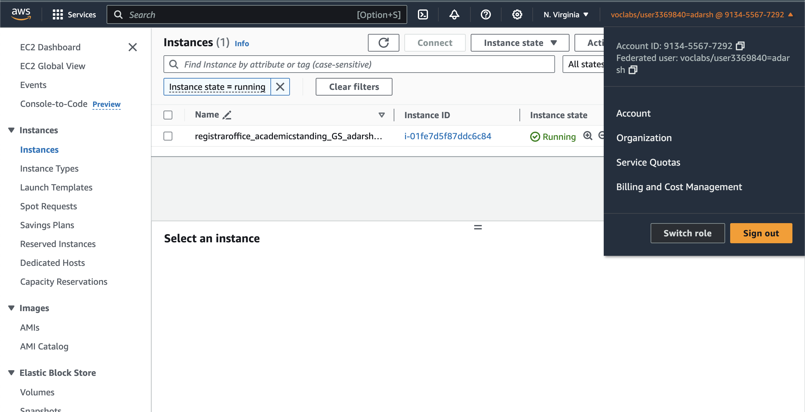

# Descriptive Analysis 

## Project Description: Descriptive Analysis of Storefront Inventory Patterns

### Project Title: Understanding Storefront Inventory Trends in the City of Vancouver

#### Objective
The primary goal of this project is to conduct a descriptive analysis of storefront inventory data for the City of Vancouver. Through this analysis, we aim to summarize key characteristics of storefront availability, identify trends over the years, and generate insights that can inform city planning, business development, and retail strategy in Vancouver.

#### Dataset
The dataset includes storefront inventory data for 2022 and 2023 from the City of Vancouver's Open Data Portal, containing the following key features:

- ID: Unique identifier for each entry.
- Unit: Unit number (if available).
- Civic number - Parcel: The street number of the property.
- Street name - Parcel: The name of the street where the property is located.
- Business name: The name of the business occupying the storefront.
- Retail category: The type of retail or service provided (e.g., Service Commercial, Food & Beverage, Vacant).
- Year recorded: The year the data was recorded (e.g., 2022).
- Geo Local Area: The local neighborhood area (e.g., Kitsilano, Arbutus Ridge).
- Geom: Geospatial data in JSON format representing the coordinates of the property.
- geo_point_2d: The latitude and longitude coordinates of the property.

#### Pipeline

### Methodology

1. **Data Collection and Discovery**
   - Access data from Vancouver's Open Data Portal, specifically for the years 2022 and 2023.
   - Use the "Year recorded" parameter to gather historical storefront data for comparison and analysis.
   - Identify patterns in the dataset by analyzing the yearly changes in the number of storefronts and business categories.

   
2. **Data Storage Design**

   - Use AWS S3 to design a structured storage system:
     - Created a bucket called "Finance and Economy" with subfolders "2022" and "2023" for easy data handling.
     - Each subfolder was divided into "Landing," "Raw," and "Curated" stages to organize the data by processing phase.
       

3. **Dataset Preparation**
   - Reduce the dataset to 188 entries for each year (2022 and 2023) to focus on the most relevant data.
   - Ensure that the dataset is ready for further analysis by filtering out unnecessary records and columns.

4. **Data Ingestion & Storage**
   - Upload CSV files for the years 2022 and 2023 into their respective "Landing" folders in AWS S3.
   - Organize the data files by year and processing stage to maintain clarity and streamline future data processing.

5. **Data Cleaning & Structuring**
   - Use AWS DataBrew to inspect and clean the data for 2022 and 2023:
     - Removed errors, duplicates, and anomalies to improve the dataset's quality.
     - Renamed columns to maintain consistency across both years.
     - Modified data types to ensure accuracy and consistency.
     - Created a "Store Age" column to calculate the age of each store based on the listing year.
    

6. **Data Pipeline Implementation**
   - Build and run an ETL pipeline using AWS Glue:
     - Deleted unnecessary columns and standardized the schema for 2022 and 2023 datasets.
     - Aggregated the total number of storefronts for each year, ensuring consistency in naming conventions.
     - Unified the datasets into a single file for further analysis, stored in the Curated folder on AWS S3.

7. **Data Analysis**
   - Set up a database and table in AWS Athena to analyze the cleaned data:
     - Queried the data to calculate the total number of storefronts for each year.
     - Named the database "financeandeconomy_storefrontsinventory_database_adarsh" and table "financeandeconomy_storefrontsinventory_table1_adarshdhatwalia".

8. **Data Visualization**
   
   - Generate a report using SQL queries and download the data in CSV format.
   - Created a bar graph using data from 2022 and 2023 to visualize trends in the number of stores. (Using Excel)

9. **Data Publishing**
   - Use Amazon EC2 to deploy two servers (General and Web servers):
     - Transferred the CSV and PDF files to the General Server using Remote Desktop.
     - Installed and deployed IIS (Internet Information Services) on the Web Server to publish the data and allow access through the server's IP address.

10. **Storefronts Segmentation**
    - Segment storefronts by year of opening (2022 vs. 2023).
    - Examine the net change in the number of stores year-over-year.

11. **Insights and Findings**
    - Summarize insights derived from the analysis, focusing on:
      - Changes in the total number of storefronts between 2022 and 2023.
      - Trends across business categories, identifying which sectors (e.g., Retail, Food Services) are experiencing growth or decline.

12. **Recommendations**
    - Propose incentives or support for business categories experiencing declines.
    - Suggest urban planning strategies for areas with a high number of vacancies.

### Tools and Technologies
- MS Excel for initial data handling and basic visualizations.
- AWS Glue for building and managing ETL pipelines.
- AWS DataBrew for cleaning, organizing, and structuring datasets.
- Amazon S3 for data storage and management.
- AWS Athena for querying data and performing analysis.
- Amazon EC2 for hosting and deploying servers to publish data.
- Draw.io for visualizing the ETL pipeline.
- Tableau or Power BI for creating advanced visual dashboards (optional)

### Deliverables
- A comprehensive report summarizing the analysis and recommendations.
- Visualizations that clearly display the data insights.
- A presentation to share findings with relevant stakeholders.

This descriptive analysis project aims to provide a comprehensive understanding of storefront inventory trends in the City of Vancouver, enabling city planners and business owners to make informed decisions, optimize urban development strategies, and enhance business sustainability.

# Data Quality Control

## Project Description: Data Quality Control Initiative at Vancouver Storefront Inventory Project

### Project Title: Implementation of Data Quality Control Measures for Vancouver Storefront Data

#### Objective
The primary objective of this project is to establish a comprehensive Data Quality Control (DQC) framework for the City of Vancouver Storefront Inventory project. This framework will ensure the accuracy, completeness, and reliability of the data, supporting enhanced decision-making processes for retail planning and urban policy development.

#### Background
As Vancouver's retail sector continues to evolve, the volume and complexity of storefront inventory data have increased, bringing challenges related to data quality such as inconsistencies, duplicate records, sensitive data and incomplete entries. Inaccurate data can lead to incorrect predictions, misguided policy recommendations, and inefficiencies. This project aims to implement robust data quality control measures to mitigate these risks, ensuring high-quality data is used in all analyses.

#### Scope
The project will focus on the following key areas:

- Data Profiling: Assess data quality with AWS DataBrew.
- Data Cleansing: Correct, deduplicate, and standardize data using AWS Glue.
- Data Protections: Apply Amazon KMS encryption for data protection.
- Data Governance: Apply AWS Glue governance rules for quality control.
- Monitoring: Use AWS CloudWatch for real-time monitoring and reporting.
- Training: Educate staff on data quality and security practices.

#### Pipeline

*Figure 1: Data Quality Control Pipeline*

### Methodology

1. **Current State Assessment**
   - Conduct a comprehensive analysis of the existing storefront datasets (2022 and 2023) to identify key data quality challenges, including inconsistencies, duplicate records, and incomplete data entries.
   - Identify critical datasets and processes that significantly influence the City of Vancouver's decision-making related to storefront inventory.

   
   
   *Figure 2: Current State Assessment*

2. **Data Cleansing Processes**
   - Develop and implement procedures for data cleansing, which may include:
     - Remove duplicates, correct errors, and standardize data formats.
     - Rename columns and create a new "store_age" column.
     - Store cleaned data in the raw folder of the S3 bucket.

   
   
   *Figure 3: Data Cleansing Processes*

3. **Data Governance Procedures**
   - Use AWS Glue to process 2022 and 2023 datasets, extracting, transforming, and loading data.
   - Apply rules to check for completeness, consistency, accuracy, and sensitive data issues.
   - Validated data is moved to the "Trusted" folder for further analysis.
   - Automate weekly data quality checks in workflow (AWS Glue) to ensure ongoing data integrity.

   
   
   
   
   
   
   *Figure 4: Data Governance Procedures*

5. **Data Protection**
   - Use AWS Key Management Service (KMS) to generate encryption keys for securely safeguarding all datasets.
   - Ensure that all data stored in AWS S3 is encrypted and backed up with replication rules in place to maintain redundancy across multiple storage locations.

   
   
   
   *Figure 5: Data Protection*

6. **Monitoring and Reporting**
   - Implement real-time monitoring using AWS CloudWatch to track essential performance indicators, such as system performance, data storage, estimated charges and alarms.
   - Set up CloudWatch alarms to trigger email notifications when costs exceed predefined thresholds.

   
   *Figure 6: Monitoring and Reporting*

7. **Training and Best Practices**
   - Develop comprehensive training materials and conduct workshops to educate team members on best practices for maintaining data quality.
   - Ensure staff is trained on data protection protocols, including the proper use of AWS KMS for encryption and AWS IAM for access control, so everyone understands their role in upholding data integrity.

8. **Feedback Mechanism**
   - Establish a continuous feedback loop to evaluate and improve data quality processes based on input from users and stakeholders.
   - Use this feedback to refine and strengthen the governance, monitoring, and data protection measures to ensure ongoing optimization of data governance.

### Tools and Technologies
- AWS DataBrew for data profiling and cleansing.
- Amazon Glue for data governance rules and the ETL pipeline.
- CloudWatch: Monitors key metrics and sets alarms for system performance and potential issues.
- Amazon S3 for data storage and replications
- Amazon KMS for key creation and encryption.

### Deliverables
- Develop a comprehensive Data Quality Control Plan detailing processes, metrics, and roles.
- Document data quality metrics and KPIs with periodic performance updates.
- Set up encryption with AWS KMS and store data in an encrypted S3 bucket.
- Prepare cleaned and validated datasets for 2022 and 2023, ready for analysis.
- Provide training resources, workshops, and best practice documentation for city staff.
- Create real-time monitoring dashboards showing data quality trends and alerts.

### Timeline
- Estimated completion: 8 weeks, encompassing data profiling, cleansing, validation setup, training, and real-time monitoring implementation.

This Data Quality Control initiative will empower the City of Vancouver to maintain high standards of data integrity and reliability, enhancing decision-making for urban planning and retail sector management.

# Academic Performance Analysis

## Project Description: Evaluating UCW Student Performance Rates to Enhance Success

### Project Title: Academic Performance Rates of Students at UCW

#### Objective
The primary objective of this project is to calculate and analyze the Academic Performance Rate (APR) across various terms at UCW. By evaluating the APR, this analysis aims to identify student performance patterns and derive actionable insights to improve academic standing and success.

#### Dataset
The dataset includes UCW student academic data for the year 2023, containing the following key features:

- **StudentID**: Unique identifier for each student.
- **Term**: Academic term (e.g., Fall 2023, Spring 2023).
- **CourseID**: Unique identifier for courses.
- **CourseName**: Name of the course.
- **Credits**: Number of credits assigned to each course.
- **Grade**: Performance grade of the student for the course.
- **CGPA**: Cumulative grade point average of the student.
- **TermGPA**: GPA for the specific term.
- **Instructor**: Name of the course instructor.
- **Department**: Department offering the course.

#### Pipeline

*Figure 1: Academic Performance Pipeline*

### Methodology

1. **Data Collection and Discovery**
   - Two test datasets (student grades and students with CGPA above 3) were generated and uploaded to an S3 bucket.
   - MS Excel was used to structure and retrieve relevant data, ensuring that only essential fields were included.

2. **Data Storage Design**
   - AWS S3 was used to design a structured storage system:
     - Created a bucket called "Finance and Economy" with subfolders "2022" and "2023" for organized data handling.
     - Each subfolder was divided into "Landing," "Raw," and "Curated" stages to structure the data by processing phase.

   
   *Figure 3: Data Storage Design*

3. **Data Ingestion & Storage**
   - Created an S3 bucket for structured data storage under the **Academic Standing** category.
   - Organized the bucket into the path: `academicstanding/2023/landing/`.
   - Stored two datasets in the following structure:
     - `student_grades` (for student grades data).
     - `studentcgpaabove3` (for students with CGPA above 3).

   
   *Figure 4: Data Ingestion and Storage*

4. **Data Cleaning & Structuring**
   - Used AWS DataBrew to clean and structure the dataset:
     - Applied schema rules to ensure consistent data types across the dataset.
     - Renamed columns for clarity and consistency (e.g., Credits to CourseCredits).
     - Identified and handled missing values and anomalies using DataBrew's data profiling options to ensure data quality.
     - The cleaned dataset was stored in the **Raw** folder within the S3 bucket under `academicstanding/2023/raw`.

   
   *Figure 5: Data Cleaning and Structuring*

5. **Data Pipeline Implementation**
   - Built a pipeline in AWS Glue to filter, aggregate, and calculate the APR for each term:
     - **Extract Data**: Pulled data from S3, including student grades and CGPA records for each term.
     - **Filter Rows**: Applied filters to include only relevant rows, such as students enrolled in each specific term and their corresponding grades.
     - **Remove Unnecessary Columns**: Dropped irrelevant columns, keeping only student ID, term, grades, and CGPA.
     - **Group by Student ID and Term**: Grouped the dataset by student ID and term to calculate performance metrics.
     - **Calculate APR**: Created a derived column for APR by calculating the ratio of students who met the academic success criteria in each term.
     - **Validate Data**: Ran validation checks to ensure calculated APR values were consistent and accurate.
     - **Export Data**: Saved the transformed data into the **Curated** folder in S3, ready for analysis and visualization.

   
   *Figure 6: Data Pipeline Implementation*

6. **Data Analysis**
   - AWS Athena was used to query the academic performance data and calculate APR per semester.
   - Retrieved APR values for each term:
     - Spring 2023: 53.33
     - Fall 2023: 68.75
     - Winter 2023: 57.14

   
   *Figure 7: Data Analysis*

7. **Data Visualization**
   - Exported query results from Athena and used Excel to create a bar plot visualizing APR trends for each term.
   - The bar chart highlighted performance rates across terms, with Fall 2023 showing the highest APR.

   
   *Figure 8: Data Visualization*

8. **Data Publishing**
   - Created two EC2 servers (General and Web) using Amazon EC2.
   - Uploaded key data files to the General Server and published the Graph_Report on the Web Server.
   - Installed and deployed IIS (Internet Information Services) on the Web Server to host and share the report.

   
   
   
   *Figure 9: Data Publishing*

9. **Academic Performance Segmentation**
   - Segmented academic performance by term (Spring 2023, Fall 2023, Winter 2023).
   - Analyzed the APR changes across these terms.

10. **Insights and Findings**
   - Summarized key insights from the analysis:
     - Identified performance trends, with Fall 2023 showing the highest APR and Spring 2023 the lowest.
     - Investigated potential reasons for the variations, including course difficulty, student engagement, and instructional factors.

11. **Recommendations**
   - Implement academic alerts for early intervention and targeted support for struggling students.
   - Enhance student resources, including tutoring and workshops, during underperforming terms.
   - Develop personalized retention programs to improve student performance.

### Tools and Technologies
- AWS S3 for data storage and management.
- AWS DataBrew for data cleaning and transformation.
- AWS Glue for creating and running data pipelines.
- AWS Athena for querying and analyzing data.
- Amazon EC2 for deploying servers and hosting data.
- Excel for creating visualizations of APR trends.
- Draw.io for visualizing the ETL pipeline.

### Deliverables
- A detailed report summarizing the methodology, findings, and APR analysis.
- Bar chart visualizations of APR across terms.
- Access to reports via an EC2 web server and general server.

This project successfully provided a comprehensive understanding of academic performance rates at UCW, enabling stakeholders to make informed decisions to enhance student success.

# Data Quality Control

## Project Description: Data Quality Control Initiative for Academic Performance Dataset at UCW

### Project Title: Implementation of Data Quality Control Measures for UCW Academic Performance

#### Objective
The primary objective of this project is to establish a comprehensive Data Quality Control (DQC) framework for the UCW Academic Performance Dataset. This framework will ensure the accuracy, privacy, governance, and data integrity necessary for enhanced decision-making in tracking student performance and supporting academic success at UCW.

#### Background
As UCW expands its student base and academic offerings, the volume and complexity of academic data have grown, introducing challenges such as inconsistencies, duplicate records, sensitive data, and incomplete entries. Inaccurate data can lead to incorrect assessments, misguided policy recommendations, and inefficiencies in managing academic progress. This project aims to implement robust data quality control measures to mitigate these risks, ensuring high-quality data is used in all academic assessments and reporting.

#### Scope
The project will focus on the following key areas:

- **Data Cleansing**: Correct, deduplicate, and standardize data using AWS Glue.
- **Data Protection**: Apply Amazon KMS encryption for data protection.
- **Data Governance**: Apply AWS Glue governance rules for quality control.
- **Monitoring**: Use AWS CloudWatch for real-time monitoring and reporting.
- **Training**: Educate staff on data quality and security practices.

#### Pipeline

*Figure 1: Data Quality Control Pipeline*

### Methodology

1. **Current State Assessment**
   - Analyze the academic performance datasets to identify inconsistencies, duplicates, and incomplete entries.
   - Highlight key datasets critical for decision-making and academic evaluations at UCW.

   
   *Figure 2: Current State Assessment*

2. **Data Cleansing Processes**
   - Use AWS Glue DataBrew to remove duplicates, correct errors, and standardize data formats.
   - Apply built-in transformations to handle missing and invalid values without requiring coding.
   - Additional steps include renaming columns (e.g., "Credits" to "CourseCredits") and creating new fields if necessary.
   - Cleaned data will be securely stored in the **Raw** folder of the S3 bucket for further processing.

   
   *Figure 3: Data Cleansing Processes*

3. **Data Governance Procedures**
   - Load data from the **Raw** folder in S3 using AWS Glue for ETL processing.
   - Detect sensitive data to ensure compliance with data privacy regulations.
   - Evaluate data quality by applying validation rules for completeness, accuracy, and consistency.
   - Use a conditional router to separate passed data from data needing review.
   - Store passed data in the **Trusted** folder for secure access.
   - Create a scheduled workflow to run weekly checks and revalidate data.

   
   
   
   *Figure 4: Data Governance Procedures*

4. **Data Protection**
   - Encrypt all data using AWS KMS to secure sensitive information and ensure compliance with UCW's data security policies.
   - Implement S3 replication policies to regularly back up data across multiple locations for redundancy.

   
   
   *Figure 5: Data Protection*

5. **Monitoring and Reporting**
   - Use AWS CloudWatch for real-time monitoring of system performance, data storage usage, and alerts related to data quality.
   - CloudWatch alarms will notify teams via email if specific thresholds, such as storage costs or data integrity issues, are breached.
   - AWS CloudTrail will create logs to monitor access and system activities, ensuring transparency and accountability for all data operations.

   
   
   *Figure 6: Monitoring and Reporting*

6. **Training and Best Practices**
   - Develop comprehensive training materials and conduct workshops for UCW staff, ensuring they are well-versed in data protection protocols.
   - Training will focus on maintaining data integrity, recognizing potential issues, and utilizing AWS tools for managing academic data.

7. **Feedback Mechanism**
   - Create a continuous feedback loop where UCW staff can provide input on data quality issues or process improvements.
   - Incorporate feedback into the system's governance and protection protocols, continually optimizing data governance measures at UCW.

### Tools and Technologies
- **AWS DataBrew**: For data profiling and cleansing to maintain clean, structured data.
- **Amazon Glue**: Governs data rules and manages the ETL pipeline.
- **Amazon S3**: Stores and replicates data for redundancy and reliability.
- **Amazon KMS**: Manages key creation and encryption for data security.
- **CloudTrail**: Tracks logs and account activity for monitoring changes and ensuring accountability.
- **CloudWatch**: Monitors key metrics and sets alarms for system performance and potential issues.

### Deliverables
- A comprehensive Data Quality Control Plan detailing processes, metrics, and staff roles.
- Encryption and secure storage of UCW’s academic data using AWS KMS and S3.
- Cleaned and validated academic datasets ready for analysis and reporting.
- Training materials and workshops for UCW staff on data protection protocols.
- Real-time monitoring dashboards to visualize data quality trends and receive alerts.

### Timeline
- Estimated completion: 10 weeks, including data cleansing, data governance, privacy, training, and real-time monitoring implementation.

This Data Quality Control initiative will empower UCW to uphold high standards of data integrity, improve the accuracy of academic evaluations, and ensure better decision-making processes in student performance tracking.
