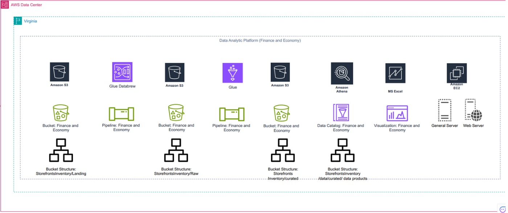

# Descriptive Analysis 

## Project Description: Descriptive Analysis of Storefront Inventory Patterns

### Project Title: Understanding Storefront Inventory Trends in the City of Vancouver

#### Objective
The primary goal of this project is to conduct a descriptive analysis of storefront inventory data for the City of Vancouver. Through this analysis, we aim to summarize key characteristics of storefront availability, identify trends over the years, and generate insights that can inform city planning, business development, and retail strategy in Vancouver.

#### Dataset
The dataset includes storefront inventory data for 2022 and 2023 from the City of Vancouver's Open Data Portal, containing the following key features:

- ID: Unique identifier for each entry.
- Unit: Unit number (if available).
- Civic number - Parcel: The street number of the property.
- Street name - Parcel: The name of the street where the property is located.
- Business name: The name of the business occupying the storefront.
- Retail category: The type of retail or service provided (e.g., Service Commercial, Food & Beverage, Vacant).
- Year recorded: The year the data was recorded (e.g., 2022).
- Geo Local Area: The local neighborhood area (e.g., Kitsilano, Arbutus Ridge).
- Geom: Geospatial data in JSON format representing the coordinates of the property.
- geo_point_2d: The latitude and longitude coordinates of the property.

#### Pipeline

### Methodology

1. **Data Collection and Discovery**
   - Access data from Vancouver's Open Data Portal, specifically for the years 2022 and 2023.
   - Use the "Year recorded" parameter to gather historical storefront data for comparison and analysis.
   - Identify patterns in the dataset by analyzing the yearly changes in the number of storefronts and business categories.

2. **Data Storage Design**
   
   - Use AWS S3 to design a structured storage system:
     - Created a bucket called "Finance and Economy" with subfolders "2022" and "2023" for easy data handling.
     - Each subfolder was divided into "Landing," "Raw," and "Curated" stages to organize the data by processing phase.

3. **Dataset Preparation**
   - Reduce the dataset to 188 entries for each year (2022 and 2023) to focus on the most relevant data.
   - Ensure that the dataset is ready for further analysis by filtering out unnecessary records and columns.

4. **Data Ingestion & Storage**
   - Upload CSV files for the years 2022 and 2023 into their respective "Landing" folders in AWS S3.
   - Organize the data files by year and processing stage to maintain clarity and streamline future data processing.

5. **Data Cleaning & Structuring**
   - Use AWS DataBrew to inspect and clean the data for 2022 and 2023:
     - Removed errors, duplicates, and anomalies to improve the dataset's quality.
     - Renamed columns to maintain consistency across both years.
     - Modified data types to ensure accuracy and consistency.
     - Created a "Store Age" column to calculate the age of each store based on the listing year.

6. **Data Pipeline Implementation**
   - Build and run an ETL pipeline using AWS Glue:
     - Deleted unnecessary columns and standardized the schema for 2022 and 2023 datasets.
     - Aggregated the total number of storefronts for each year, ensuring consistency in naming conventions.
     - Unified the datasets into a single file for further analysis, stored in the Curated folder on AWS S3.

7. **Data Analysis**
   - Set up a database and table in AWS Athena to analyze the cleaned data:
     - Queried the data to calculate the total number of storefronts for each year.
     - Named the database "financeandeconomy_storefrontsinventory_database_adarsh" and table "financeandeconomy_storefrontsinventory_table1_adarshdhatwalia".

8. **Data Visualization**
   
   - Generate a report using SQL queries and download the data in CSV format.
   - Created a bar graph using data from 2022 and 2023 to visualize trends in the number of stores. (Using Excel)

9. **Data Publishing**
   - Use Amazon EC2 to deploy two servers (General and Web servers):
     - Transferred the CSV and PDF files to the General Server using Remote Desktop.
     - Installed and deployed IIS (Internet Information Services) on the Web Server to publish the data and allow access through the server's IP address.

10. **Storefronts Segmentation**
    - Segment storefronts by year of opening (2022 vs. 2023).
    - Examine the net change in the number of stores year-over-year.

11. **Insights and Findings**
    - Summarize insights derived from the analysis, focusing on:
      - Changes in the total number of storefronts between 2022 and 2023.
      - Trends across business categories, identifying which sectors (e.g., Retail, Food Services) are experiencing growth or decline.

12. **Recommendations**
    - Propose incentives or support for business categories experiencing declines.
    - Suggest urban planning strategies for areas with a high number of vacancies.

### Tools and Technologies
- MS Excel for initial data handling and basic visualizations.
- AWS Glue for building and managing ETL pipelines.
- AWS DataBrew for cleaning, organizing, and structuring datasets.
- Amazon S3 for data storage and management.
- AWS Athena for querying data and performing analysis.
- Amazon EC2 for hosting and deploying servers to publish data.
- Draw.io for visualizing the ETL pipeline.
- Tableau or Power BI for creating advanced visual dashboards (optional)

### Deliverables
- A comprehensive report summarizing the analysis and recommendations.
- Visualizations that clearly display the data insights.
- A presentation to share findings with relevant stakeholders.

This descriptive analysis project aims to provide a comprehensive understanding of storefront inventory trends in the City of Vancouver, enabling city planners and business owners to make informed decisions, optimize urban development strategies, and enhance business sustainability.
